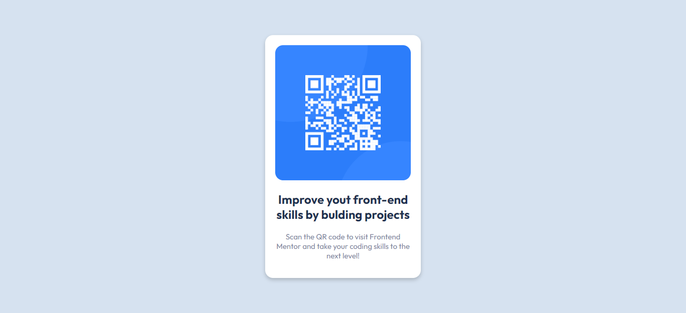

# Frontend Mentor - QR code component solution

This is a solution to the [QR code component challenge on Frontend Mentor](https://www.frontendmentor.io/challenges/qr-code-component-iux_sIO_H). Frontend Mentor challenges help you improve your coding skills by building realistic projects. 

## Table of contents

- [Overview](#overview)
  - [Screenshot](#screenshot)
  - [Links](#links)
- [Built with](#built-with)
- [What I learned](#what-i-learned)
- [Continued development](#continued-development)
- [Useful resources](#useful-resources)
- [Author](#author)

## Overview

### Screenshot

Mobile: 


Desktop: 

### Links

- Solution URL: [https://github.com/JeshrunSamuel/Mobile-first_Qr-code.git]
- Live Site URL: [https://jeshrunsamuel.github.io/Mobile-first_Qr-code/]

## Built with

- Semantic HTML5 markup
- CSS custom properties


## What I learned

In this project I learn to do resposive design by using "media queries"for CSS and responsive card design using CSS.Along the way I learned how to use git and github on my projects.

These are some snippets of the media queries

```css
@media only screen and (max-width: 375px) {
  
    #wrapper {
        width: 100%;
    }
    .container {
        width: 100%;
        margin: 0;
    }
}
```

## Continued development

I want go further and deep on learning Responsive designs and CSS grid system in the near future.

## Useful resources

- [https://www.w3schools.com/] - This helped me for learning media queries and card designs in CSS.

## Author

- Frontend Mentor - [@JeshrunSamuel](https://www.frontendmentor.io/profile/JeshrunSamuel)

